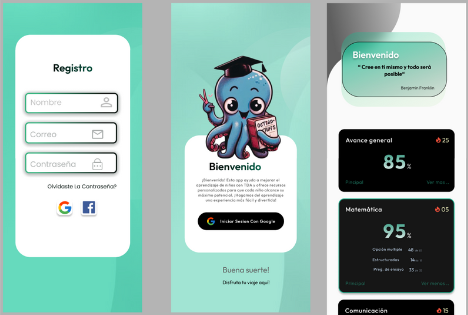
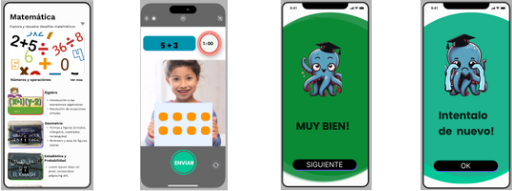
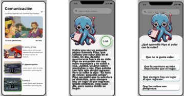
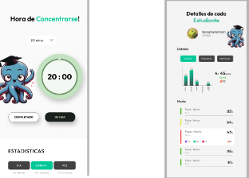

# App de Aprendizaje para Niños con TDAH

Esta aplicación está diseñada para apoyar a niños con Trastorno por Déficit de Atención e Hiperactividad (TDAH) mediante métodos didácticos y material lúdico. Nuestra misión es crear una experiencia de aprendizaje divertida y accesible que ayude a mejorar la atención y habilidades cognitivas de los niños, utilizando herramientas interactivas.

## Características
- **Métodos Didácticos:** Juegos interactivos que refuerzan el aprendizaje en áreas como matemáticas, lectura y ciencias.
- **Material Lúdico:** Actividades visuales y auditivas que captan la atención de los niños, ayudando a mantener su interés por más tiempo.
- **Progresión Personalizada:** El niño avanza a su propio ritmo, con recompensas que fomentan su motivación.
- **Interfaz Adaptativa:** Diseñada con colores y sonidos que estimulan sin abrumar.

## Imágenes de Muestra

### Presentación

### Actividades de Concentración

### Textos Cortos y Personalizados

### Cronómetro Personal y Autoseguimiento

## MockUp
- **Enlace:** [Figma Octav.io](https://www.figma.com/proto/cbnqJXicDQNTs7eSdIedQ9/Students'-Progress-Tracking-App-(Community)?node-id=461-442&starting-point-node-id=461%3A442).
  
## Herramientas

Cosmo BD: [Documentacion](https://pub.dev/packages/azure_cosmosdb)
Vertex AI: [Caracteristicas](https://cloud.google.com/generative-ai-studio?hl=es_419)
Template: [Templates manejados](https://flutterawesome.com/task-management-ui-design-with-flutter/)
